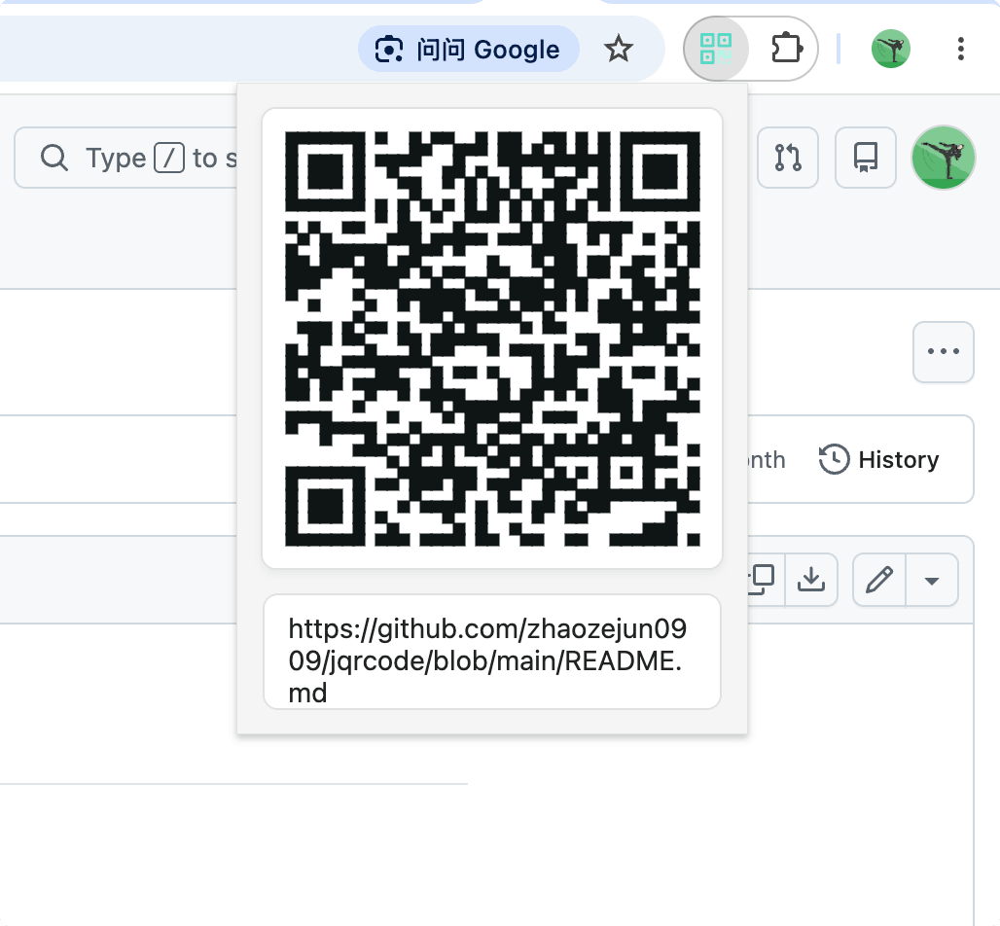

# jqrcode
chrome 插件，功能简洁，就是二维码生成和识别二维码

* 大小自适应，保证方便识别
* 内置多种二维码美化样式
* 显示 url，并支持动态调整
* 自动替换 localhost 为你本地 ip
* 网页图片增加右键识别二维码功能，识别任意网页二维码图片

  

## 安装与使用

下载仓库后，在 `chrome://extensions` 开启开发者模式，选择“加载已解压的扩展程序”并选中仓库目录。

1. 点击插件图标，生成当前页面网址的二维码；也可以输入文本生成。
2. 右键网页图片，选择“识别二维码”。识别代码仅在点击菜单后加载，普通浏览网页时不会自动注入。
3. 首次识别其他域名的图片时，Chrome 可能请求图片域名的访问权限。本地图片还需要在扩展详情页开启“允许访问文件网址”。
4. 右键插件图标进入“选项”，配置二维码尺寸、localhost 地址转换和右键菜单开关。

需要 Chrome 106 或更新版本。识别功能需要浏览器与系统支持原生 `BarcodeDetector` 的 `qr_code` 格式；没有内置 jsQR 回退。

